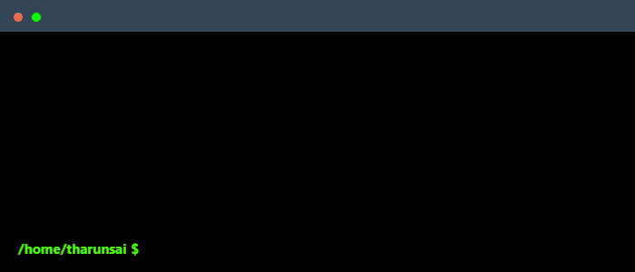

 

  

### 🎯 My Mission
As a Computer Science undergraduate with a passion for solving real-world problems, I focus on building scalable and responsive web/mobile applications. I leverage my knowledge in full-stack development (MERN & Flutter) and data structures to tackle impactful challenges.Aiming for top-tier roles in tech companies.

---

### 🛠️ Core Technologies & Tools

---

### 📚 Currently Exploring

---

### 🚀 Projects

- 🔹 **AgriConnect App**  
  *Flutter + Firebase mobile application empowering farmers to sell produce directly to consumers.*  
  `Status:` In Progress

- 🔹 **E-Commerce Web Platform**  
  *A responsive MERN stack application with REST APIs, authentication, and cart management.*  
  `Impact:` Reduced payment errors by 20%, improved server response time by 25%.

- 🔹 **Netflix Clone**  
  *Frontend replica of Netflix using HTML/CSS/JavaScript with responsive carousel & navigation.*

- 🔹 **To-Do List Web App**  
  *Built using vanilla JavaScript for dynamic task addition, deletion, and updates.*

- 🔹 **HackerRank Automation**  
  *Python-based automation for streamlining coding challenge submissions.*

---

### 📊 GitHub Stats

---

### 📌 Connect with Me

    
    <!-- 
     -->

---

<!-- ### 📝 Employer?

> 📄 [**Download My Resume**](https://drive.google.com/file/d/YOUR_RESUME_LINK_HERE/view?usp=sharing)

--- -->

     Thanks for scrolling all the way down :)

